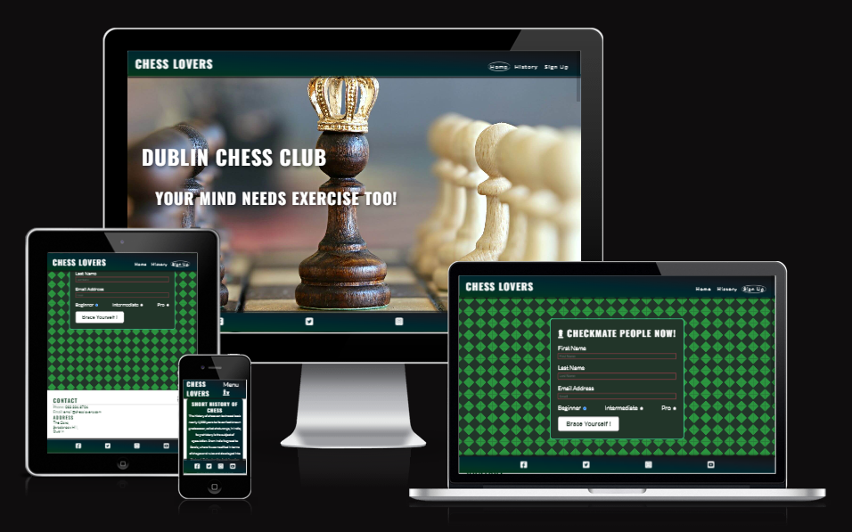

# Chess Lovers

Chess Lovers is a club site that intends to gather people that like to learn, play & enjoy the beautiful game of chess. This site will be targeted towards all ages regardless if they are begginers, intermediate or advanced. Chess Lovers will have the options for new students to sign up for classes but also for those that do not wish to learn but just to enjoy a game or two.

## Features

In this section, you should go over the different parts of your project, and describe each in a sentence or so. You will need to explain what value each of the features provides for the user, focusing on who this website is for, what it is that they want to achieve and how your project is the best way to help them achieve these things.

### Existing Features

- **Navigation Bar**

  - Featured on all three pages, the full responsive navigation bar includes links to the Logo, Home page, History and Sign Up page and is identical in each page to allow for easy navigation.
  - This section will allow the user to easily navigate from page to page across all devices without having to revert back to the previous page via the ‘back’ button.

- **The landing page image**

  - The landing includes a photograph with text overlay to allow the user to see exactly which location this site would be applicable to.
  - This section introduces the user to Love Running with an eye catching animation to grab their attention

- **Club Ethos Section**

  - The club ethos section will allow the user to see the benefits of joining the Love Running meetups, as well as the benefits of running overall.
  - This user will see the value of signing up for the Love Running meetups. This should encourage the user to consider running as their form of exercise.

- **Meetup Times section**

  - This section will allow the user to see exactly when the meetups will happen, where they will be located and how long the run will be in kilometers.
  - This section will be updated as these times change to keep the user up to date.

- **The Footer**

  - The footer section includes links to the relevant social media sites for Love Running. The links will open to a new tab to allow easy navigation for the user.
  - The footer is valuable to the user as it encourages them to keep connected via social media

- **Gallery**

  - The gallery will provide the user with supporting images to see what the meet ups look like.
  - This section is valuable to the user as they will be able to easily identify the types of events the organisation puts together.

- **The Sign Up Page**

  - This page will allow the user to get signed up to Love Running to start their running journey with the community. The user will be able specify if they would like to take part in road, trail or both types of running. The user will be asked to submit their full name and email address.

- ## Testing

### Validator Testing

- HTML
  - No errors were returned when passing through the official [W3C validator](https://validator.w3.org/nu/#textarea)
- CSS
  - No errors were found when passing through the official [(Jigsaw) validator](https://jigsaw.w3.org/css-validator/validator)

### Fixed Bugs

- H1 hover grow didn`t work on larger screens
- (Solution) Change font-size and transfer styling in media query
- Missing part of screen fixed by adding padding px instead %

## Deployment

- The site was deployed to GitHub pages. The steps to deploy are as follows:
  - In the GitHub repository, navigate to the Settings tab
  - From the source section drop-down menu, select the Main Branch
  - Once the main branch has been selected, the page will be automatically refreshed with a detailed ribbon display to indicate the successful deployment.

The live link can be found here - <https://code-institute-org.github.io/love-running-2.0/index.html>

## Credits

- Links hover idea from [CSS Tricks](https://css-tricks.com/css-link-hover-effects/)
- Parts of text taken from [Way too Wise](<https://way2wise.com/chess/chess-quotes/>)
- Youtube responsiness code borrowed from [CSS Trick: How to make an embedded iframe responsive?](https://www.youtube.com/watch?v=QG7JQkeaJy4)
- Some of form style found at [Front End Joe`s Page](https://frontendjoe.com/)
- Sign Up page background created at [Superdesigner](https://superdesigner.co/tools/css-backgrounds)

### Content

- The text for the History page was taken from Wikipedia 
- Instructions on how to implement form validation on the Sign Up page was taken from [Love running](https://learn.codeinstitute.net/courses/course-v1:CodeInstitute+LRFX101+2023_Q2/courseware/e805068059af42af87681032aa64053f/fc8bba87c52a4d91b32d1c7c28b1d79b/?child=first)
- The icons in the footer were taken from [Font Awesome](https://fontawesome.com/)
- Images taken from [Pexels](https://www.pexels.com/search/chess/)

### Media

- The favicon used on the home and sign up page is from [Chess icons created by VectorPortal - Flaticon](https://www.flaticon.com/free-icons/chess)
- The images used for the gallery page were taken from this other open source site

